# Majestic LLM

**A model compiler, not a model.** You do not build one model flexible enough to
build any small model — you build a compiler. There is a specification IR, a
planner that runs verified passes over it, and a backend matrix that targets
devices. Flexibility is a property of the architecture, not of any one component.

<p align="center">
  
</p>

Majestic turns a plain-language description into a **certified, device-sized
specialist**: it interviews the customer, type-checks the request against
physics, law and its own catalogue, refuses what is impossible *before spending
anything*, then builds, proves and packages what is possible. What ships is not a
model file — it is a **scorecard** proving a small specialist does one job as
well as a large generalist, plus the installable artefact for the device the
customer owns.

> **Status: implemented and runnable, offline on CPU.** The seven subsystems, the
> three-level IR with its three gates, the device-aware feasibility engine
> (including KV-cache accounting), the typed-DAG runtime, multi-adapter serving,
> constrained decoding, the learned deferral router and the flywheel all run with
> tiny/mock defaults and no downloads. Heavy paths (real HF models, PEFT LoRA,
> sentence-transformers, FAISS, GGUF/ONNX export) sit behind lazy imports.
> Frontier pre-training, JEPA/world-models and image generation remain deliberate
> stubs. See [docs/research-gaps.md](docs/research-gaps.md) for what is genuinely
> unsolved versus merely unimplemented.

## Quickstart
```bash
uv venv --python 3.12 .venv && uv pip install -e '.[api,dev]'
python demo/run_compiler_demo.py     # the ten-act worked example, end to end
python -m cli.main validate          # model compatibility + architecture conformance
python -m cli.main budget            # the B-09 device RAM budget, computed
pytest                               # green offline: no network, no GPU
```
Full walkthrough: [docs/USAGE.md](docs/USAGE.md). Conformance evidence:
[docs/conformance.md](docs/conformance.md).

## The compiler
```
FORGE -> Spec IR -> [GATE 1] -> PLANNER -> Build Plan IR -> [GATE 2]
      -> DATA FACTORY -> TRAINER -> PROVING GROUND -> [GATE 3]
      -> CARTRIDGE -> REGISTRY -> FABRIC
```

| # | Subsystem | What it does |
|---|---|---|
| 1 | **FORGE** | slot-filling interview that asks four questions, not forty — and picks them by pushing candidate answers through the **Planner** and keeping the ones that move the plan ([detail](docs/forge.md)) |
| 2 | **PLANNER** | seven hard predicates over an enumerable plan space; returns a plan **or a refusal with a witness**. Deterministic — no LLM on the common path ([detail](docs/planner.md)) |
| 3 | **DATA FACTORY** | seed-anchored amplification behind blocking QA gates; refuses below the real-seed floor |
| 4 | **TRAINER** | LoRA/QLoRA by default; parallel candidates where the plan is uncertain |
| 5 | **PROVING GROUND** | seven axes, all must pass; re-run in full after quantisation |
| 6 | **REGISTRY** | content-addressed cartridges; base stored once, adapters are deltas |
| 7 | **FABRIC** | typed DAG, statically verified for offline closure, RAM and cost — and it runs |

**Every gate is checked before any GPU is spent.** A refusal in eight seconds is
a better product than a failed build in ninety minutes:

```
admitted : False
stage    : gate1  (no planning, no data, no GPU)
  - seed data 5 is below the floor of 200 real examples for primitive 'generate'
  - quality bar unachievable: 'generate' needs at least 1.7B but
    android_lowend caps the base at 1.182B at 4-bit
```

## What is actually enforced
- **The largest base that fits at 4-bit** — never a smaller base at higher
  precision. Under a fixed RAM budget that is the k-bit scaling law's verdict.
- **Memory is weights + KV cache + runtime**, never weights alone. Free RAM must
  be ≥ 2× the model file, which is why a 4 GB phone tops out near 1.7B at 4-bit.
- **MoE is excluded from constrained devices.** Sparse activation is not sparse
  residency: 30B must be held to activate 3B.
- **Candidates are trained in parallel and one is chosen.** The largest base that
  fits RAM may still break the latency budget, and the budget is a contract.
- **Answer-flip rate**, not just accuracy. A quantised model can hold identical
  aggregate accuracy while changing a large share of individual answers. The
  quantiser is calibrated on the customer's own distribution and confidence is
  recalibrated afterwards.
- **A compiled grammar, not a hopeful prompt.** Schema violation is impossible
  rather than unlikely.
- **Untrusted content cannot reach a privileged tool** — proven statically, then
  enforced again at runtime.
- **A latency promise is never made from unmeasured hardware.** Effective
  throughput runs at 30–60% of peak; a planner that interpolates it is
  fabricating a commitment, so `P_lat` refuses unless the estimate is explicitly
  accepted — or until a **device probe** measures the target
  ([detail](docs/device-verification.md)).
- **The device certifies the model, not the vendor.** Two short benchmarks on the
  customer's own hardware calibrate `t = S/BW_eff + c` exactly, which predicts
  latency for the whole catalogue on that device. All promises use the
  *sustained* rate, after the thermal derate.
- **A cartridge is certified per device, and per artefact kind.** The same
  cartridge may be certified for one SoC and unverified for another; a device
  absent from the manifest is reported as unverified rather than assumed fine.
  Throughput alone certifies nothing — a run that did not execute the eval subset
  **on the device** is refused a certificate, because compilation and format
  conversion can change the outputs while every aggregate number holds steady.
- **Merging happens in BF16, never into the 4-bit training base.** There are two
  separate quantisations in the pipeline and conflating them loses most of the
  fine-tune while every step reports success.
- **Refusal is a return value, not an exception** — with a minimal witness and
  ordered remedies. Even a *free* build is refused below θ\* = (C+κ)/(V+κ),
  because the damage of shipping a bad model is not the compute you burned.
- **Latency is prefill + decode, and for document work prefill dominates.** A
  1000-token form producing 80 tokens of JSON puts ~67% of the time in prefill,
  so costing decode alone understates the truth by ~3×. `expected_input_tokens`
  is therefore a first-class Spec IR field, and a decode-only probe is not
  allowed to promise a prefill-bound workload.
- **Seven resource dimensions, six of them probed.** Storage and energy bind
  independently of memory: a phone can hold an artefact it cannot load, and a
  tablet doing 200 forms a day spends ~40% of its battery on inference
  ([detail](docs/forge.md)).
- **A question is asked only when its answer changes the build.** Every question
  costs attrition — `P(complete) = e^(−γq)` — so FORGE asks iff
  `IG·stake·Λ > γ`, and the information gain is *measured* by running the
  Planner over each candidate answer rather than guessed from parser entropy. A
  slot can be maximally ambiguous and still worth zero questions.

---

# Architecture diagrams

The complete set. **Part A** is prior art the design rests on, **Part B** is the
proposed architecture, **Part C** is honest comparison. Colours are consistent
throughout:

| | |
|---|---|
| 🟧 **Majestic component or rule** | what this project contributes |
| 🟥 **Binding constraint / verification gate** | what refuses a build |
| ⬛ **Contract artefact** | the IR everything binds to |
| 🟩 **Certified output** | what the customer receives |
| 🟦 **Prior art** | the published result being used |
| ⬜ **Commodity step / external actor** | available off the shelf |

---

## Part A — prior art

<details>
<summary><b>A-01 · Decoder-only transformer and the on-device memory budget</b> — why deployable size is bounded by weights <i>plus</i> KV cache <i>plus</i> runtime</summary>

<p align="center">
  
</p>

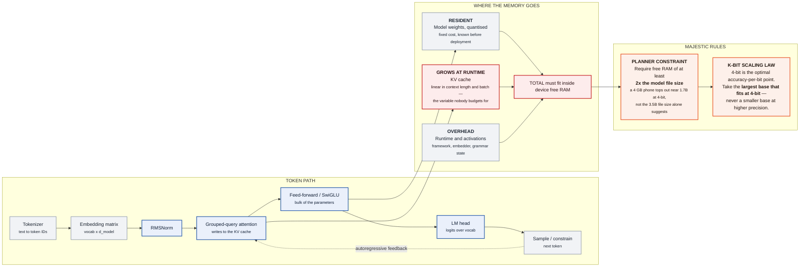

**Why it matters to Majestic:** the deployable model size is bounded by weights
PLUS KV cache PLUS runtime, not weights alone.
*Prior art: Vaswani et al. 1706.03762; GQA; Dettmers & Zettlemoyer 2212.09720.*

</details>

<details>
<summary><b>A-02 · Knowledge distillation — the two transfer paths</b> — path selection is decided by tokenizer identity, not preference</summary>

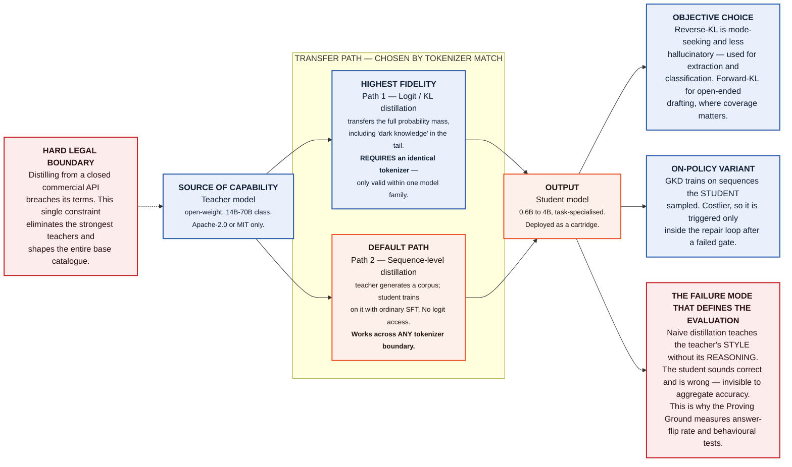

*Prior art: Hinton et al. 1503.02531; Kim & Rush 1606.07947; GKD 2306.13649; MiniLLM 2306.08543; Orca 2306.02707.*

</details>

<details>
<summary><b>A-03 · LoRA — the adapter that becomes the cartridge</b> — why 500 customer models occupy 16 GB instead of 550 GB</summary>

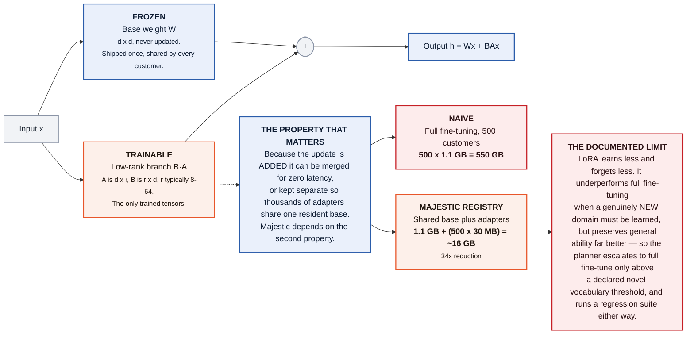

*Prior art: Hu et al. 2106.09685; QLoRA 2305.14314; DoRA 2402.09353; Biderman et al. 2405.09673.*

</details>

<details>
<summary><b>A-04 · Multi-adapter serving — one GPU, many customers</b> — the published result that makes hosted unit economics work</summary>

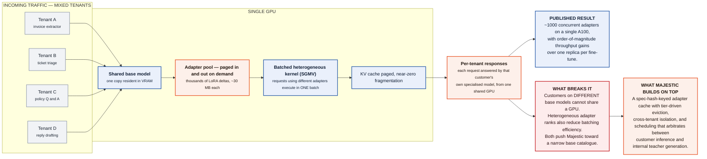

*Prior art: S-LoRA 2311.03285; Punica 2310.18547; vLLM PagedAttention 2309.06180.*

</details>

<details>
<summary><b>A-05 · Post-training quantisation</b> — where a good fine-tune quietly dies</summary>

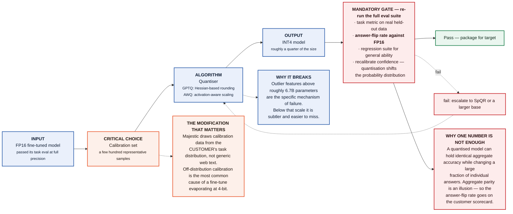

*Prior art: GPTQ 2210.17323; AWQ 2306.00978; LLM.int8(); "Accuracy is Not All You Need" 2407.09141.*

</details>

<details>
<summary><b>A-06 · Retrieval-augmented generation</b> — knowledge in the index, behaviour in the adapter</summary>

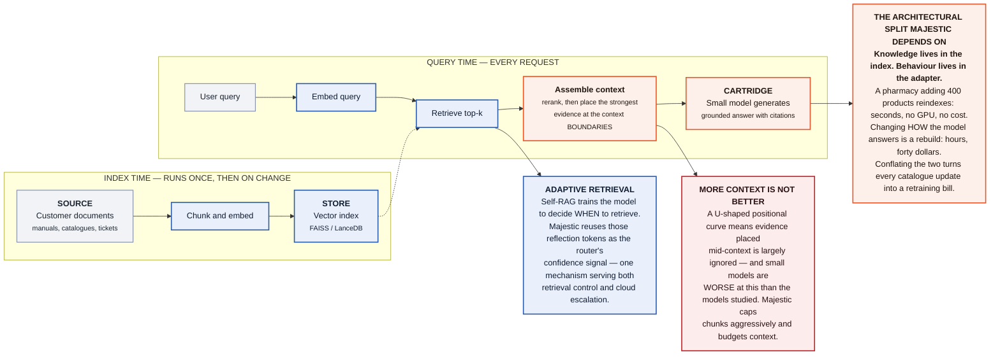

*Prior art: Lewis et al. 2005.11401; DPR 2004.04906; Self-RAG 2310.11511; Lost in the Middle 2307.03172.*

</details>

<details>
<summary><b>A-07 · Sparse mixture-of-experts routing</b> — the ancestor of cartridge routing, and a warning about phones</summary>

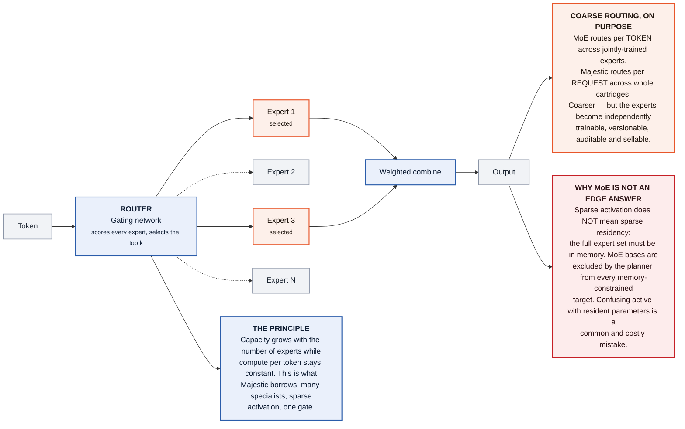

*Prior art: Shazeer et al. 1701.06538; Switch Transformer 2101.03961; Mixtral 2401.04088.*

</details>

<details>
<summary><b>A-08 · LLM cascades and learned routing</b> — Majestic inverts the economics: the cheap tier is the user's own device</summary>

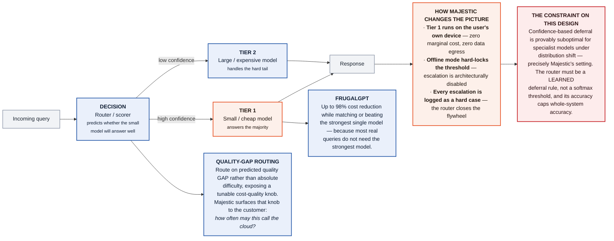

*Prior art: FrugalGPT 2305.05176; RouteLLM 2406.18665; Hybrid LLM 2404.14618; 2307.02764.*

</details>

<details>
<summary><b>A-09 · The ReAct loop and tool calling</b> — web scraping is a tool the model calls, never a capability it contains</summary>

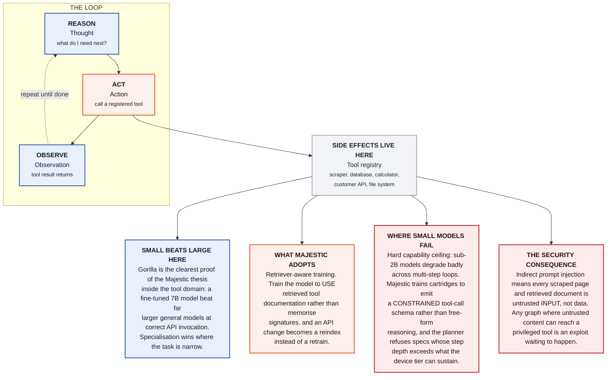

*Prior art: ReAct 2210.03629; Toolformer 2302.04761; Gorilla 2305.15334; indirect prompt injection 2302.12173.*

</details>

<details>
<summary><b>A-10 · Compiler architecture</b> — the template Majestic copies, and the answer to the founding question</summary>

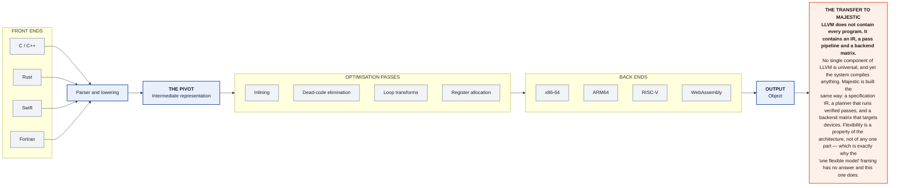

*Prior art: LLVM (Lattner & Adve, CGO 2004); TVM 1802.04799; MLIR 2002.11054.*

</details>

---

## Part B — the proposed architecture

### B-01 · Majestic system architecture — the seven subsystems

> **Master diagram.** Every other diagram in Part B expands one block of this one.
> **LLMs occupy exactly five roles; everything else is deterministic software.**

```mermaid
flowchart TB
  CUST["<b>ACTOR</b><br/>Customer<br/><small>non-technical owner, or developer</small>"]

  subgraph FRONT["FRONT END"]
    direction LR
    S1["<b>SUBSYSTEM 1</b><br/>FORGE — specification builder<br/><small>interview agent for non-technical users;<br/>direct IR editing for developers. Fills a TYPED<br/>SLOT SCHEMA, asking only about slots left<br/>empty or ambiguous. <b>LLM ROLE 1 — front end.</b></small>"]
    SPEC["<b>THE PIVOT — SPEC IR</b><br/><small>hash-addressed, versioned, typed JSON.<br/>Task primitive, I/O schema, device target, offline<br/>flag, latency budget, policy, data rights, quality bar.<br/><b>The contract everything downstream depends on.</b></small>"]
    S1 --> SPEC
  end

  S2["<b>SUBSYSTEM 2</b><br/>PLANNER — build plan compiler<br/><small>constrained search over a typed parts catalogue with HARD<br/>feasibility predicates. Deterministic by default; an LLM proposes<br/>only when no precedent matches, and a validator always disposes.<br/><b>LLM ROLE 5 — tie-breaker.</b></small>"]

  subgraph BUILD["BUILD PIPELINE — ASYNC, METERED, CACHED"]
    direction LR
    S3["<b>SUBSYSTEM 3</b><br/>DATA FACTORY<br/><small>seed-anchored synthetic generation from the<br/>customer's own documents. Dedup, quality filter,<br/>diversity monitor, PII scrub. Real held-out set<br/>locked and never trained on.<br/><b>LLM ROLE 2 — teacher.</b></small>"]
    S4["<b>SUBSYSTEM 4</b><br/>TRAINER<br/><small>LoRA / QLoRA by default, full fine-tune for paid<br/>tiers, DPO and KTO for preference. Parallel<br/>candidate builds where the plan is uncertain.<br/>Zero custom training loops.</small>"]
    S5["<b>SUBSYSTEM 5</b><br/>PROVING GROUND<br/><small>task metrics, calibrated judge, behavioural tests,<br/>regression, safety, post-quantisation re-eval.<br/><b>GATE-ENFORCED:</b> below threshold the model<br/>never reaches the customer.<br/><b>LLM ROLES 3 and 4 — judge and repairer.</b></small>"]
    S3 --> S4 --> S5
  end

  subgraph RUNTIME["OUTPUT AND RUNTIME"]
    direction LR
    S6["<b>SUBSYSTEM 6</b><br/>REGISTRY<br/><small>content-addressed cartridges. Base stored once,<br/>adapters are deltas. Model card, eval certificate,<br/>licence chain and provenance on every artefact.</small>"]
    S7["<b>SUBSYSTEM 7</b><br/>FABRIC<br/><small>typed DAG runtime. Nodes are cartridges, tools and<br/>control flow. Statically verified for offline closure,<br/>RAM and cost. Runs on server, on device, or hybrid.</small>"]
    DELIV["<b>WHAT IS SOLD — DELIVERABLE</b><br/><small>Not a model file — a SCORECARD proving a 1 GB<br/>specialist does one job as well as a 140 GB generalist,<br/>plus the installable artefact for the customer's device.</small>"]
    S6 --> S7 --> DELIV
  end

  CUST -- "spec" --> S1
  SPEC --> S2 --> S3
  S5 --> S6
  S5 -. "<b>REPAIR LOOP</b> — plan mutation on gate failure" .-> S3
  DELIV -. "field corrections feed the flywheel" .-> S1

  classDef maj fill:#fdf0ea,stroke:#e8562a,stroke-width:2px,color:#20160f
  classDef gate fill:#fdecec,stroke:#c62026,stroke-width:2px,color:#2a1113
  classDef con fill:#0f1723,stroke:#0f1723,stroke-width:2px,color:#ffffff
  classDef ok fill:#eaf6ef,stroke:#1b7f4b,stroke-width:2px,color:#0e2a1b
  classDef com fill:#f1f3f6,stroke:#8a94a6,stroke-width:1.5px,color:#1b2430
  class S1,S2,S3,S4,S6,S7 maj
  class S5 gate
  class SPEC con
  class DELIV ok
  class CUST com
```

### B-02 · The compiler mapping: LLVM to Majestic

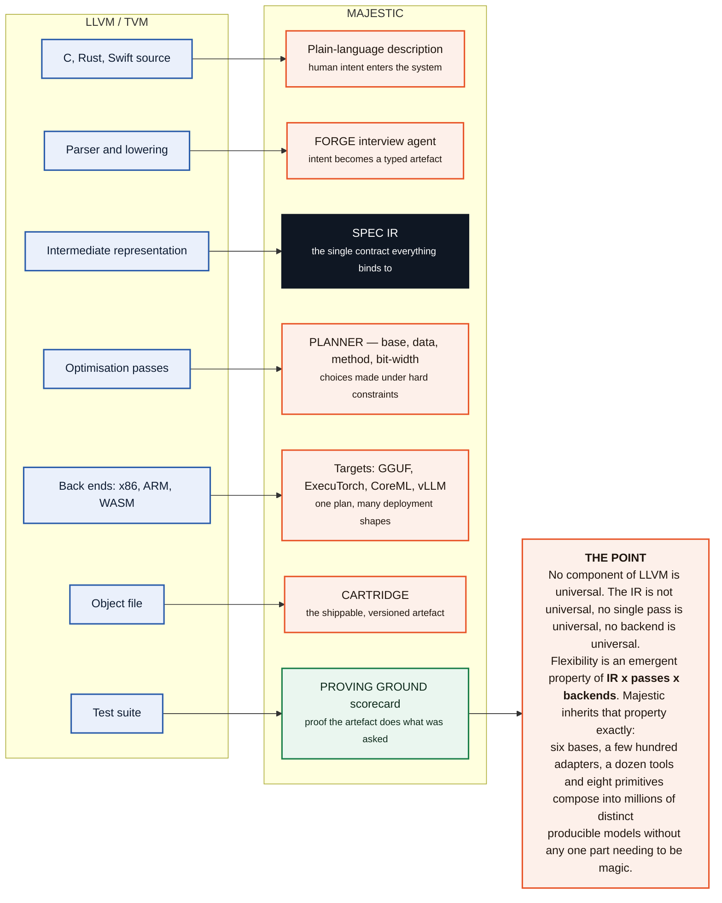

### B-03 · The three-level IR stack and its verification gates

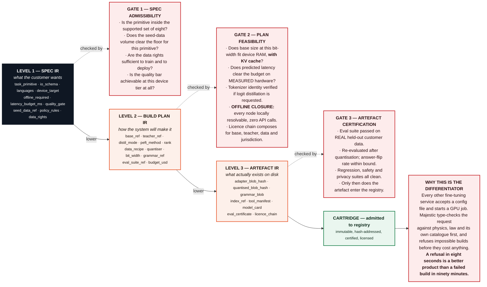

### B-04 · FORGE — from plain language to a typed specification

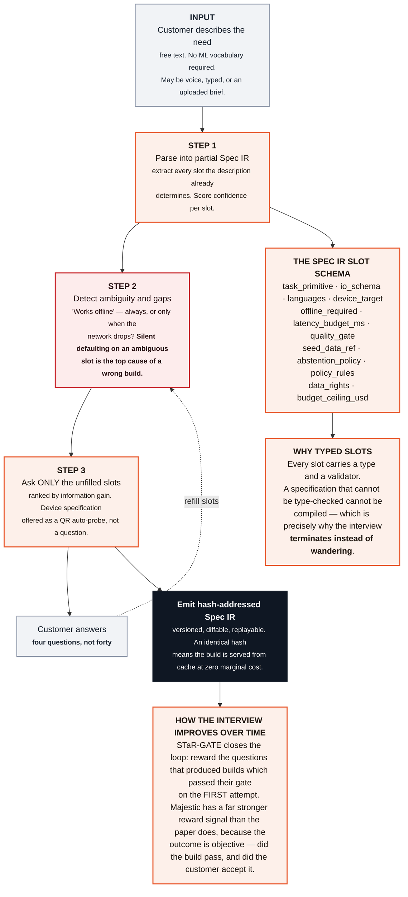

### B-05 · PLANNER — deterministic first, LLM only at the edges

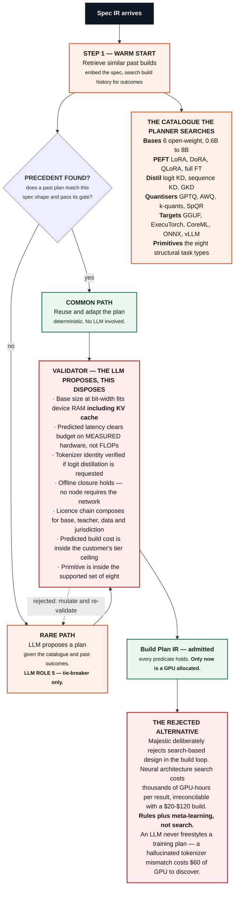

### B-06 · DATA FACTORY — amplification with collapse guardrails

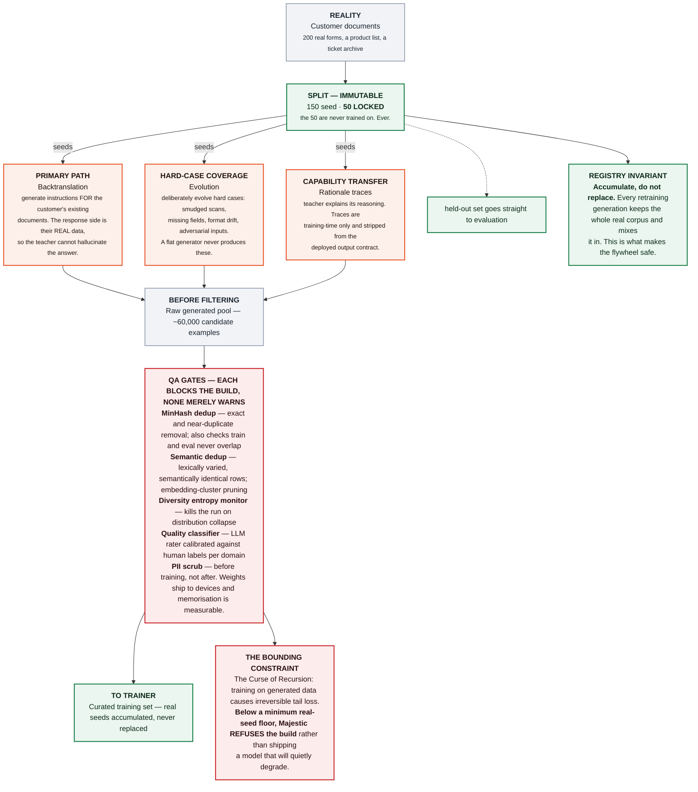

### B-07 · PROVING GROUND — the gate, and the repair loop behind it

> **This subsystem is the actual product.** A build that cannot be proven correct
> on the customer's own data is not sellable.

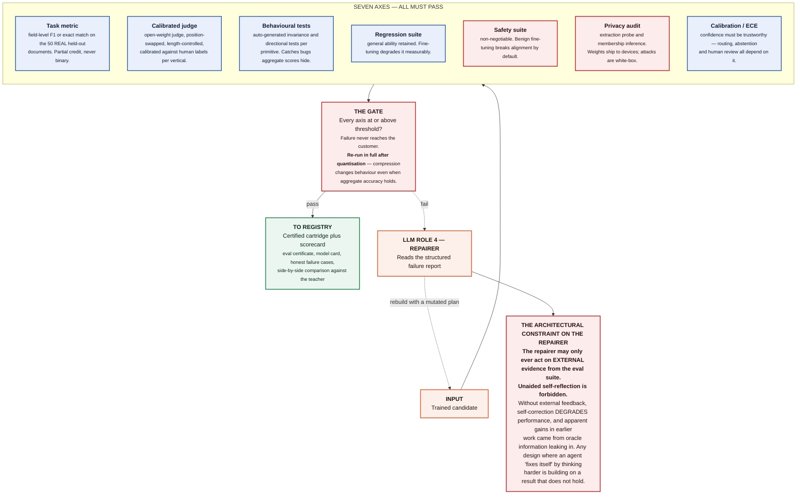

### B-08 · The cartridge, and the registry that makes it cheap

```mermaid
flowchart LR
  subgraph CART["CARTRIDGE ANATOMY — FIVE SLOTS"]
    direction TB
    C1["<b>SLOT 1 — BASE REFERENCE</b><br/><small>pointer only, never a copy. Pinned hash. <b>~0 bytes stored</b></small>"]
    C2["<b>SLOT 2 — ADAPTER STACK</b><br/><small>the trained LoRA delta. <b>The customer's IP. ~30 MB</b></small>"]
    C3["<b>SLOT 3 — TOOL BINDINGS</b><br/><small>scoped permissions for scraper, database, calculator, API. ~KB</small>"]
    C4["<b>SLOT 4 — I/O CONTRACT</b><br/><small>prompt template plus a compiled grammar that makes<br/>schema violation <b>impossible</b>. ~KB</small>"]
    C5["<b>SLOT 5 — RUNTIME POLICY</b><br/><small>offline or hybrid, confidence threshold, abstention, fallback. ~KB</small>"]
  end

  CERT["<b>WHAT MAKES IT TRUSTWORTHY — ATTACHED CERTIFICATION</b><br/><small>eval certificate, model card, datasheet, licence chain, provenance record.<br/><b>Auto-generated from pipeline telemetry — never hand-authored.</b></small>"]

  NAIVE["<b>NAIVE — ONE FULL MODEL EACH</b><br/><b>550 GB</b> = 500 x 1.1 GB<br/><small>~$2.50 per model per month</small>"]
  CA["<b>CONTENT-ADDRESSED — BASE STORED ONCE</b><br/><b>~16 GB</b> = 1.1 GB + (500 x 30 MB)<br/><small>~$0.02 to $0.10 per model per month — <b>34x</b></small>"]
  DEDUP["<b>DEDUP IS NOT ONLY FOR WEIGHTS</b><br/>Datasets, eval suites, grammars and quantised artefacts are all hash-keyed.<br/>An identical spec hash skips the build entirely and serves the cached cartridge at<br/>zero marginal cost — which is why cache-hit rate should be tracked as closely as revenue."]
  LIN["<b>THE OPERATIONAL DIVIDEND</b><br/>Lineage is free once storage is content-addressed. When a defect is found in a base,<br/>the registry can name every cartridge derived from it and rebuild the affected fleet.<br/>Provenance turns homogenisation risk from an unbounded incident into a query."]
  CAV["<b>THE HONEST CAVEAT</b><br/>Base diversity limits blast radius but fragments the shared-base serving economics of A-04.<br/>This is a genuine strategic trade, not a solved problem."]

  CART --> CERT
  CERT --> NAIVE --> CA --> DEDUP --> LIN --> CAV

  classDef maj fill:#fdf0ea,stroke:#e8562a,stroke-width:2px,color:#20160f
  classDef gate fill:#fdecec,stroke:#c62026,stroke-width:2px,color:#2a1113
  classDef ok fill:#eaf6ef,stroke:#1b7f4b,stroke-width:2px,color:#0e2a1b
  classDef com fill:#f1f3f6,stroke:#8a94a6,stroke-width:1.5px,color:#1b2430
  class C2,C3,C4,C5,CA,DEDUP maj
  class NAIVE,CAV gate
  class CERT,LIN ok
  class C1 com
```

### B-09 · Runtime topology — server multi-tenant and on-device

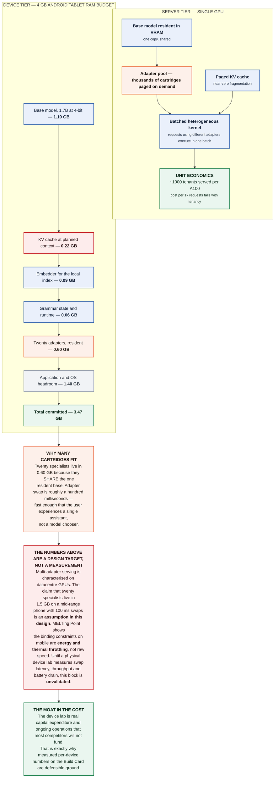

### B-10 · FABRIC — typed DAG, hybrid routing, and the flywheel

<p align="center">
  
</p>

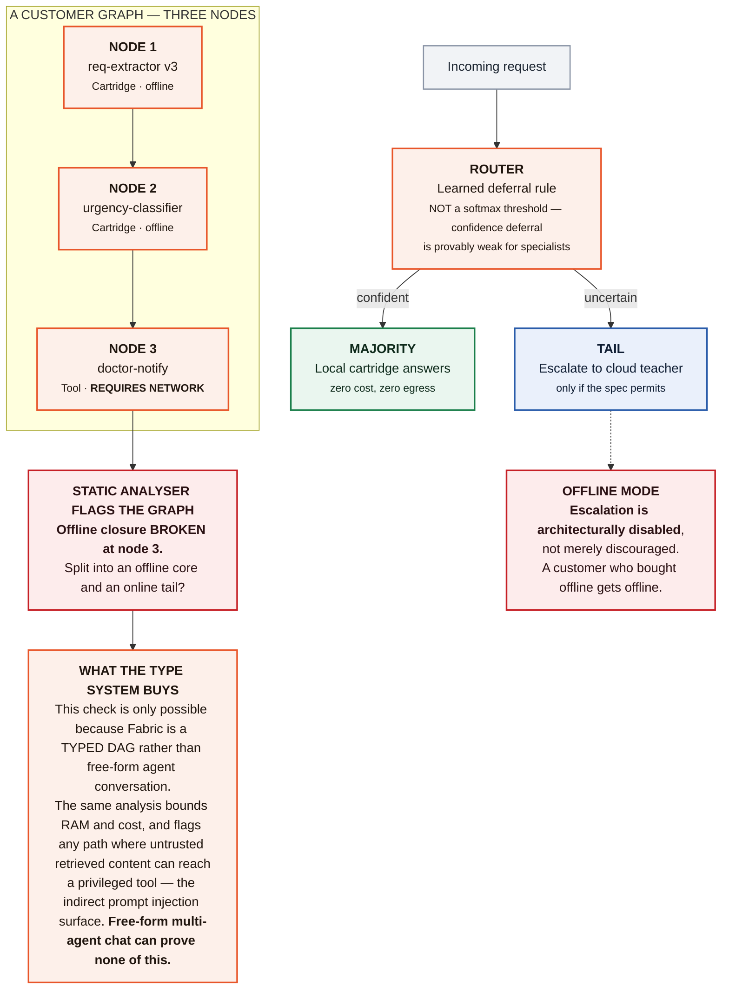

**Why this loop is the strategy, not a feature:** escalated queries and corrected
fields are the hard cases the local model could not handle. Accumulated across
years and customers, that corpus is the one asset a competitor cannot clone — the
interface is a month of work, the compiler is six months of lead, the per-vertical
eval library is eighteen months, and the failure corpus is permanent.

---

## Part C — comparison

### C-01 · What exists, what is assembly, and what is genuinely new

```mermaid
flowchart LR
  subgraph SOLVED["SOLVED — USE OFF THE SHELF"]
    direction TB
    S["LoRA and QLoRA training<br/>Multi-adapter serving (S-LoRA)<br/>GPTQ, AWQ, k-quant compression<br/>GGUF, CoreML, ONNX packaging<br/>vLLM serving and PagedAttention<br/>Vector indexing and retrieval<br/>Constrained decoding grammars<br/>DPO, ORPO, KTO preference training<br/>MinHash and semantic dedup<br/>Job orchestration and metering"]
  end

  subgraph ASSEMBLY["ASSEMBLY — REAL WORK, NO NOVELTY"]
    direction TB
    A["Wiring the seven subsystems together<br/>Device benchmark matrix and lab operations<br/>Per-vertical judge calibration<br/>Backend packaging and verification<br/>Billing, tiers and cache accounting<br/>Customer-facing scorecard rendering<br/>Tool manifest and permission scoping<br/>Registry service and lineage tracking"]
  end

  subgraph NEW["GENUINELY NEW — THE CONTRIBUTION"]
    direction TB
    N1["<b>The Spec IR itself</b><br/><small>no published schema carries task intent, device constraints,<br/>offline requirements, policy and licence terms in one<br/>type-checkable artefact</small>"]
    N2["<b>Gate-before-GPU validation</b><br/><small>every competitor accepts a config and starts a job.<br/>Type-checking against physics, law and catalogue first<br/>is unclaimed ground.</small>"]
    N3["<b>Offline-closure static analysis</b><br/><small>no agent framework can statically prove a graph runs<br/>without a network. Only a typed DAG can.</small>"]
    N4["<b>Build-outcome meta-learning</b><br/><small>predicting gate pass from a spec embedding turns build<br/>history into a compounding planner asset</small>"]
    N5["<b>Automated licence-chain solving</b><br/><small>composing base, teacher, data and jurisdiction terms per<br/>build is done by lawyers today, not software</small>"]
    N6["<b>The accumulated failure corpus</b><br/><small>years of real customer hard cases. Not clonable at any<br/>price. <b>This is the only permanent moat.</b></small>"]
  end

  READ["<b>THE STRATEGIC READ</b><br/>Moat ranking, honestly: <b>the interface is worth nothing</b> — clonable in a month. The compiler and planner are worth<br/>roughly <b>six months</b> of lead. The per-vertical evaluation library is worth <b>eighteen</b>. The accumulated customer failure<br/>corpus is <b>permanent</b>. Build toward the last one, and treat the first three as necessary costs of entry."]

  SOLVED --> ASSEMBLY --> NEW --> READ

  classDef maj fill:#fdf0ea,stroke:#e8562a,stroke-width:2px,color:#20160f
  classDef gate fill:#fdecec,stroke:#c62026,stroke-width:2px,color:#2a1113
  classDef pri fill:#eaf0fb,stroke:#2a5caa,stroke-width:2px,color:#0f1d33
  classDef com fill:#f1f3f6,stroke:#8a94a6,stroke-width:1.5px,color:#1b2430
  class S pri
  class A com
  class N1,N2,N3,N4,N5,N6 maj
  class READ gate
```

**Only the right-hand column is defensible.** Everything left of it is available
to any competent competitor within months.

### C-02 · End-to-end build — one customer, ten acts

> A diagnostics chain needs offline lab-requisition extraction on 4 GB Android tablets.

```mermaid
flowchart LR
  subgraph P1["PHASE ONE — SPECIFY AND BUILD"]
    direction LR
    ACT1["<b>ACT 01 · CUSTOMER</b><br/>Describe the need<br/><small>'Read lab forms into our system.<br/>Must work when the internet dies.'</small>"]
    ACT2["<b>ACT 02 · FORGE</b><br/>Interview, four questions<br/><small>device auto-probe returns 4 GB Android.<br/>Upload 200 forms. Flag or guess?<br/>Handwriting too?</small>"]
    ACT3["<b>ACT 03 · FORGE</b><br/>Plan in eight seconds<br/><small>offline closure verified. 4 GB caps the<br/>base at 1.7B — the 4B misses by 165 MB.<br/>Customer opted in to two candidates.</small>"]
    ACT4["<b>ACT 04 · BUILD</b><br/>Split, then amplify<br/><small>150 seed, 50 LOCKED. Teacher generates<br/>60k anchored forms with occlusion<br/>and format drift.</small>"]
    ACT5["<b>ACT 05 · BUILD</b><br/>Train two candidates<br/><small>QLoRA on a 1.7B and a 0.6B base, in<br/>parallel, on rented A100s. Forty minutes.<br/><b>Opt-in: faster, not cheaper.</b></small>"]
    ACT1 --> ACT2 --> ACT3 --> ACT4 --> ACT5
  end

  subgraph P2["PHASE TWO — PROVE, CERTIFY AND DEPLOY"]
    direction LR
    ACT6["<b>ACT 06 · PROVE</b><br/>Score both, pick one<br/><small>1.7B scores 0.94 F1 at ~13.8 s.<br/>0.6B scores 0.88 at ~4.5 s — below the<br/>0.93 gate. <b>1.7B wins, and the budget<br/>had to be relaxed to 15 s.</b></small>"]
    ACT7["<b>ACT 07 · PROVE</b><br/>Quantise, then re-score<br/><small>Q4_K_M gives 0.937, above gate.<br/>Flip rate inside bound. Regression and<br/>safety suites pass.</small>"]
    ACT8["<b>ACT 08 · REGISTRY</b><br/>Certify and package<br/><small>model card, eval certificate and licence<br/>chain attached. GGUF built for<br/>Android CPU.</small>"]
    ACT9["<b>ACT 09 · CUSTOMER</b><br/>Read the scorecard<br/><small>93.7% on their OWN 50 forms, twelve<br/>sample extractions, three honest<br/>failure cases.</small>"]
    ACT10["<b>ACT 10 · REGISTRY</b><br/>Deploy and run offline<br/><small>QR install. The cartridge downloads<br/>once, then runs with WiFi switched off.</small>"]
    ACT6 --> ACT7 --> ACT8 --> ACT9 --> ACT10
  end

  EXP["<b>WHAT THE CUSTOMER EXPERIENCES</b><br/>Total wall clock is roughly <b>fifty-two minutes</b>. Marginal cost is<br/><b>twenty to forty dollars</b>, or <b>zero</b> on a spec-hash cache hit.<br/>The customer never receives a model file — they receive a<br/>scorecard and an install link."]
  FIX["<b>TWO NUMBERS IN THIS FLOW WERE WRONG, AND THE PLANNER CAUGHT THEM</b><br/>This diagram once read <b>1.6 s</b> for act 6. The arithmetic says <b>~13.8 s</b> — a 500-token form is<br/>prefill-bound, and prefill is compute-bound at roughly 50 tok/s on a mid-range CPU.<br/>It also implied parallel candidates were free. They are <b>strictly worse in expected cost</b>:<br/>E[cost]₂/E[cost]₁ = 2/(2−p) > 1. They buy wall-clock time, so they are opt-in."]
  NEXT["<b>WHAT HAPPENS NEXT</b><br/>Act eleven, two months later: staff corrections accumulate, sync<br/>when online, and Majestic offers v4 <b>only if it beats v3</b> on a<br/>held-out set that has GROWN with real data.<br/>That is where the compounding begins."]

  ACT5 -- "continue" --> ACT6
  ACT10 --> EXP
  ACT10 --> NEXT
  ACT6 --> FIX

  classDef maj fill:#fdf0ea,stroke:#e8562a,stroke-width:2px,color:#20160f
  classDef gate fill:#fdecec,stroke:#c62026,stroke-width:2px,color:#2a1113
  classDef ok fill:#eaf6ef,stroke:#1b7f4b,stroke-width:2px,color:#0e2a1b
  classDef pri fill:#eaf0fb,stroke:#2a5caa,stroke-width:2px,color:#0f1d33
  classDef com fill:#f1f3f6,stroke:#8a94a6,stroke-width:1.5px,color:#1b2430
  class ACT2,ACT3 maj
  class ACT6,ACT7 gate
  class ACT4,ACT5 pri
  class ACT8,ACT10,EXP ok
  class ACT1,ACT9,NEXT com
  class FIX gate
```

---

## Layout
```
majestic-llm/
├── README.md · pyproject.toml · requirements.txt   (light core deps; heavy deps optional/lazy)
├── configs/        default · models · routing · devices
├── docs/           architecture · forge · planner · device-verification · USAGE
│   │               CONTRIBUTING · conformance · research-gaps
│   └── diagrams/   animated SVGs used above
├── modelrig/                       ← the compiler
│   ├── ir.py                       Spec / Build Plan / Artefact IR (hash-addressed)
│   ├── gates.py                    Gate 1/2/3 — checked before any GPU
│   ├── primitives.py · catalogue.py · licence.py   (the closed set, parts, legal)
│   ├── forge/                      ← the front end
│   │   ├── slots.py                the schema: elicited vs probed vs derived
│   │   ├── parser.py               plain language → a partial Spec IR
│   │   ├── posterior.py            parse_K: absence and ambiguity kept apart
│   │   ├── infogain.py             the Planner as the information-gain oracle
│   │   └── core.py                 the attrition rule; when to stop asking
│   ├── planner/                    enumeration + the predicates (optimisation passes)
│   ├── candidates.py               parallel builds → score both → pick one
│   ├── data_factory.py · proving_ground.py   amplification + the seven axes
│   ├── quantisation.py · grammar.py   calibration, flip rate, constrained decoding
│   ├── cartridge.py · registry.py  content-addressed artefacts + lineage
│   ├── feasibility.py              KV-cache-aware device predictor
│   ├── resources.py                the seven resource dimensions, as pure functions
│   ├── probe.py                    two-point calibration; the verification ladder
│   ├── weights.py                  hash pinning, BF16 merge, merged-vs-separate
│   ├── quantformat.py              SIMD flags select the quantisation format
│   ├── devicedb.py                 the compounding device model
│   ├── certification.py            per-device certification; the on-device eval subset
│   ├── conformance.py              model compatibility + architecture self-check
│   ├── pipeline.py                 end to end, with the repair loop
│   └── buildspec · compiler · planes · classifier · datasets · training_hf
├── majestic/                       ← the compound runtime
│   ├── orchestrator.py · factory.py   request lifecycle + assembly
│   ├── fabric/     graph · analyser · executor   (typed DAG that runs)
│   ├── serving.py                  adapter pool, batching, device RAM budget
│   ├── agent/react.py              ReAct with a constrained tool-call schema
│   ├── router/     rule_router · deferral   (capability routing, learned deferral)
│   ├── flywheel.py                 corrections → KTO signal → rebuild-if-wins
│   ├── core · perception · experts · retrieval · verification · representation
├── api/ · cli/ · demo/ · tests/
```

## Honest bounds
Two load-bearing promises are **unvalidated** and the code says so everywhere it
touches them: on-device swap latency and thermals (GAP-10, every device profile
ships `measured: false`), and multi-generation flywheel quality (GAP-05). Only
the right-hand column of C-01 is defensible; everything else is available to a
competent competitor within months.

## Notes
- Lint targets `ruff`. Where an OS application-control policy blocks unsigned
  binaries, `python -m pyflakes majestic modelrig api cli demo tests` is a
  correctness fallback.
- Optional dependency groups: `.[api]`, `.[ml]`, `.[retrieval]`, `.[compress]`, `.[dev]`.
- The animated diagrams are hand-written SVG in [docs/diagrams/](docs/diagrams/).
  GitHub strips animation from inline Mermaid, so the three flows that benefit
  most from motion are drawn as SVG and the full set is Mermaid.
